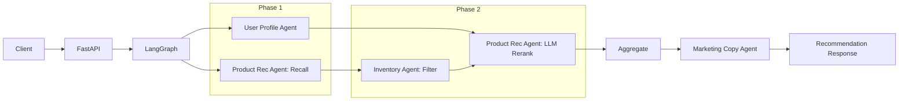

# Multi-Agent 电商推荐与营销系统（Python 版）

基于 **Python + FastAPI + LangGraph** 构建的多 Agent 电商推荐项目。系统将用户画像、商品推荐、库存决策和营销文案生成拆分为独立 Agent，通过 LangGraph 编排、异步并行和降级机制完成推荐链路。

## 核心能力

- **Multi-Agent 编排**：LangGraph + 4 个专业 Agent。
- **异步并行执行**：画像与商品召回并行；库存过滤后，仅对可售商品执行 LLM 精排。
- **稳定性治理**：统一超时、指数退避重试和 fallback 降级。
- **推荐重排**：基于用户画像和候选商品执行 LLM 排序。
- **营销文案生成**：按用户分群切换 Prompt 模板并执行敏感词过滤。
- **A/B 实验**：一致性哈希分桶与 Thompson Sampling 动态分配。
- **运行指标**：提供 Agent 调用次数、成功率和平均延迟查询。

## 系统架构



LangGraph 是唯一推荐编排链路，对外入口为 `/api/v1/recommend`。

## Agent 职责

| Agent | 职责 | 主要输入 | 主要输出 |
| --- | --- | --- | --- |
| UserProfileAgent | RFM、分群与偏好分析 | 用户行为数据 | 用户画像 |
| ProductRecAgent | 候选筛选与 LLM 重排 | 用户画像、商品列表 | 推荐商品 |
| InventoryAgent | 可用库存校验、预警和限购 | 商品列表 | 可用商品及限购规则 |
| MarketingCopyAgent | 分群文案生成与合规过滤 | 用户画像、商品列表 | 营销文案 |

## 技术栈

- Python 3.11+
- FastAPI
- LangGraph、LangChain
- asyncio
- Pydantic
- Tenacity
- MiniMax / OpenAI-Compatible LLM API
- Redis FeatureStore（可选组件）
- structlog
- Docker Compose

## 快速启动

### 方式一：本地 Python + Docker Redis

先启动 Redis：

```bash
docker compose up -d redis
docker compose exec redis redis-cli ping
```

看到 `PONG` 后启动 API：

```bash
cd python
python -m venv .venv

# Windows PowerShell
.venv\Scripts\Activate.ps1

# macOS / Linux
source .venv/bin/activate

pip install -r requirements.txt
cp .env.example .env
python main.py
```

本机运行 API 时，`.env` 中的 Redis 地址应为：

```text
ECOM_REDIS_URL=redis://localhost:6379/0
```

服务启动成功后会看到：

```text
feature_store.enabled
app.startup
```

如果 Redis 不可用，服务仍会启动，但会自动禁用 FeatureStore 并回退到 context/默认画像数据。

服务地址：

- API：`http://127.0.0.1:8000`
- Swagger：`http://127.0.0.1:8000/docs`
- 健康检查：`http://127.0.0.1:8000/health`

### 方式二：Docker Compose 启动 API + Redis

```bash
docker compose up --build
```

该方式会同时启动 FastAPI API 和 Redis，不需要在宿主机单独运行 Python。API 容器使用的 Redis 地址为：

```text
ECOM_REDIS_URL=redis://redis:6379/0
```

## 环境变量

| 变量 | 说明 |
| --- | --- |
| `ECOM_LLM_API_KEY` | LLM API Key |
| `ECOM_LLM_BASE_URL` | OpenAI-Compatible API 地址 |
| `ECOM_LLM_MODEL` | 模型名称，默认 `qwen-max` |
| `ECOM_REDIS_URL` | 可选 Redis 地址 |
| `ECOM_AB_TEST_ENABLED` | 是否启用 A/B 实验 |

## API

| 方法 | 路径 | 说明 |
| --- | --- | --- |
| `GET` | `/health` | 健康检查 |
| `POST` | `/api/v1/recommend` | LangGraph 推荐流程 |
| `POST` | `/api/v1/behaviors` | 写入 Redis FeatureStore 用户行为 |
| `GET` | `/api/v1/experiments` | 查询实验状态 |
| `GET` | `/api/v1/metrics` | 查询 Agent 与业务指标 |
| `POST` | `/api/v1/experiments/{experiment_id}/outcome` | 记录实验结果 |

推荐请求示例：

```bash
curl -X POST "http://127.0.0.1:8000/api/v1/recommend" \
  -H "Content-Type: application/json" \
  -d '{"user_id":"u001","scene":"homepage","num_items":5}'
```


行为上报示例：

```bash
curl -X POST "http://127.0.0.1:8000/api/v1/behaviors" \
  -H "Content-Type: application/json" \
  -d '{"user_id":"u001","behavior_type":"view","item_id":"P001","metadata":{"category":"手机"}}'
```

## 核心实现指标

以下数据可由代码和配置直接验证：

| 项目 | 配置 |
| --- | ---: |
| 专业 Agent 数量 | 4 |
| 异步编排阶段 | 2 |
| 阶段内并行任务 | 画像与商品召回 |
| 单个 Agent 最大重试次数 | 2 |
| 用户画像 Agent 超时 | 5s |
| 商品推荐 Agent 超时 | 8s |
| 营销文案 Agent 超时 | 10s |
| 库存 Agent 超时 | 5s |
| A/B 分桶数量 | 100 |
| 营销 Prompt 模板 | 5 |
| 广告法敏感词规则 | 10 |
| REST API 数量 | 6 |
| A/B 单元测试 | 5 |

## 项目结构

```text
.
├── docker-compose.yml
├── python
│   ├── agents/                  # 4 个业务 Agent 与基础容错逻辑
│   ├── config/                  # 应用配置
│   ├── models/                  # Pydantic 数据结构
│   ├── orchestrator/            # LangGraph 编排
│   ├── services/                # A/B、FeatureStore 与指标组件
│   ├── tests/                   # 单元测试
│   ├── .env.example
│   ├── Dockerfile
│   ├── main.py                  # FastAPI 入口
│   └── requirements.txt
└── README.md
```

## 当前限制

- 商品推荐当前基于 `MOCK_PRODUCTS` 示例数据，尚未接入真实商品库。
- Redis `FeatureStore` 已接入用户画像链路；Redis 不可用时自动降级，不阻断推荐服务启动。
- 库存判断基于请求中的商品库存字段，尚未接入 WMS 或数据库。
- A/B 实验数据与指标当前保存在内存中，服务重启后会重置。
- 当前没有 Milvus 向量检索、MCP、WMS、RAG 或 ReAct 的真实运行链路。
- 仓库未提供 P99、QPS、CTR、CVR、GMV 等压测或线上实验数据，请勿将预期目标写成实测结果。

## License

MIT
